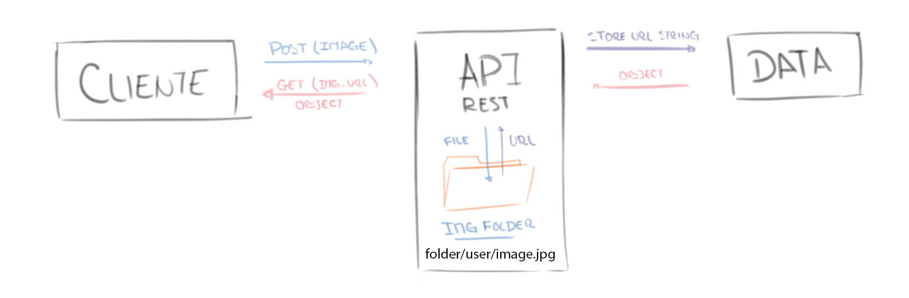

# Portfolio Backend
Esta API se encarga de la comunicación entre el FrontEnd y la base de datos, junto con la implementación de determinadas funciones como el manejo de imágenes y el envio de mails.  
+ Al ejecutar la API por **primera vez** se crea una Person vacía en la BBDD
+ Se encarga del almacenamiento y eliminado de imagenes compartiendo las url correspondientes con la BBDD
+ Manda emails desde un email especificado en **Application.properties**  

La creación de la Person vacía tiene dos moivos, ambos orientados a la experiencia de usuario brindandole la facilidad de ingresar al Front y modificar todo desde ahi y evitar tener que abrir otros programas o ejecutar las ordenes para agregar los datos en BBDD.


# MailSender
El envío de mail se realiza con la dependencia JavaMailSender, esto requiere introducir un email y contraseña desde el cual se envian los mensajes. Para el email es posible utilizar uno diferente del propio de Person pero obligatoriamente **debe ser Gmail**

## Contraseña  
La contraseña **no puede ser la del mail**, se requiere de una app password (Contraseña para app), esta se consigue en:  
**Administrar cuenta de Google > Seguridad > Contraseñas de aplicación**  

# Image Management  
Las imágenes **no se guardan el BBDD**, en esta solo se almacena una url que lleva a la "carpeta publica" de la API en donde se encuentran almacenadas las imágenes. Esto evita tener que registrarse en páginas que brindan este tipo de servicios, por un lado, y por el otro evita almacenar variables muy grandes en BBDD como los ByteArray o base64.  

  

Ingresa un MultipartFile al controller que contiene la imagen y mediante FileUploadUtil el sistema se encarga de almacenarla en el directorio y devuelve una url como *apiURL/user-photos/1/projects/4.jpg* que apunta a la imágen del proyecto con ID = 4 de la persona con ID = 1 (A modo de ejemplo).  
El directorio se compone de la siguiente forma

```
user-photos   
│
└───{ Person.ID }
│   │
│   │   about.png
│   │   header.png
│   │
│   └───projects
│   │   │   { Project.ID }.jpg
│   │   │   ...
│   │
│   └───education
│   │   │   { Education.ID }.jpg
│   │   │   ...
│   │
│   └───experience
│       │   { Experience.ID }.jpg
│       │   ...
│    
└───{ Person.ID2 }
    │   about.png
    │   header.png
    ...
```  

# Métodos

## EducationController

| **Methods** | **Urls**               | **Actions**                                                     |
|:-----------:|------------------------|-----------------------------------------------------------------|
| GET         | /education             | Devuelve una lista con todas las Education                      |
| GET         | /education/{id}        | Devuelve la Education.{id}                                      |
| GET         | /education/person/{person_id} | Devuelve una lista de Education pertenecientes a la Person.{id} |
| POST        | /education/{person_id} | Crea una nueva Education en la BBDD para la Person.{person_id}  |
| PUT         | /education/{id}        | Actualiza los datos de la Education.{id}                        |
| PUT         | /education/{id}/image  | Actualiza la imagen de la Education.{id}                        |
| DELETE      | /education/{id}        | Elimina la Education.{id}                                       |

## ExperienceController

| **Methods** | **Urls**               | **Actions**                                                     |
|:-----------:|------------------------|-----------------------------------------------------------------|
| GET         | /experience             | Devuelve una lista con todas las Experience                     |
| GET         | /experience/{id}        | Devuelve la Experience.{id}                                     |
| GET         | /experience/person/{person_id} | Devuelve una lista de Experience pertenecientes a la Person.{id} |
| POST        | /experience/{person_id} | Crea una nueva Experience en la BBDD para la Person.{person_id}  |
| PUT         | /experience/{id}        | Actualiza los datos de la Experience.{id}                        |
| PUT         | /experience/{id}/image  | Actualiza la imagen de la Experience.{id}                        |
| DELETE      | /experience/{id}        | Elimina la Education.{id}                                       |
  
## ImageController

| **Methods** | **Urls**               | **Actions**                                                     |
|:-----------:|------------------------|-----------------------------------------------------------------|
| GET         | /image             | Devuelve una lista con todas las Image                      |
| GET         | /image/{id}        | Devuelve la Image.{id}                                      |
| GET         | /image/person/{person_id} | Devuelve la Image pertenecientes a la Person.{id} |
| POST        | /image/{person_id} | Crea una nueva Image en la BBDD para la Person.{person_id}  |
| PUT         | /image/{id}        | Actualiza los datos de la Image.{id}                        |
| PUT         | /image/{id}/header | Actualiza los datos de la Image.{id}.header                        |
| PUT         | /image/{id}/about | Actualiza los datos de la Image.{id}.about                        |
| DELETE      | /image/{id}        | Elimina la Image.{id}                                       |

## JobTypeController

| **Methods** | **Urls**               | **Actions**                                                     |
|:-----------:|------------------------|-----------------------------------------------------------------|
| GET         | /jobtype             | Devuelve una lista con todas las JobType                      |
| GET         | /jobtype/{id}        | Devuelve la JobType.{id}                                      |
| POST        | /jobtype | Crea una nueva JobType en la BBDD  |
| PUT         | /jobtype/{id}        | Actualiza los datos de la JobType.{id}                        |
| DELETE      | /jobtype/{id}        | Elimina la JobType.{id}                                       |

## PersonController

| **Methods** | **Urls**               | **Actions**                                                     |
|:-----------:|------------------------|-----------------------------------------------------------------|
| GET         | /person             | Devuelve una lista con todas las Person                      |
| GET         | /person/{id}        | Devuelve la Person.{id}                                      |
| POST        | /person | Crea una nueva Person en la BBDD  |
| PUT         | /person/{id}        | Actualiza los datos de la Person.{id}                        |
| DELETE      | /person/{id}        | Elimina la Person.{id}                                       |

## ProjectController

| **Methods** | **Urls**               | **Actions**                                                     |
|:-----------:|------------------------|-----------------------------------------------------------------|
| GET         | /project             | Devuelve una lista con todas las Project                     |
| GET         | /project/{id}        | Devuelve la Project.{id}                                     |
| GET         | /project/person/{person_id} | Devuelve una lista de Project pertenecientes a la Person.{id} |
| POST        | /project/{person_id} | Crea una nueva Project en la BBDD para la Person.{person_id}  |
| PUT         | /project/{id}        | Actualiza los datos de la Project.{id}                        |
| PUT         | /project/{id}/image  | Actualiza la imagen de la Project.{id}                        |
| DELETE      | /project/{id}        | Elimina la Project.{id}                                       |

## SkillController

| **Methods** | **Urls**               | **Actions**                                                     |
|:-----------:|------------------------|-----------------------------------------------------------------|
| GET         | /skill             | Devuelve una lista con todas las Skill                     |
| GET         | /skill/{id}        | Devuelve la Skill.{id}                                     |
| GET         | /skill/person/{person_id} | Devuelve una lista de Skill pertenecientes a la Person.{id} |
| POST        | /skill/{person_id} | Crea una nueva Skill en la BBDD para la Person.{person_id}  |
| PUT         | /skill/{id}        | Actualiza los datos de la Skill.{id}                        |
| PUT         | /skill/{id}/image  | Actualiza la imagen de la Skill.{id}                        |
| DELETE      | /skill/{id}        | Elimina la Skill.{id}                                       |

## SocialMediaController

| **Methods** | **Urls**               | **Actions**                                                     |
|:-----------:|------------------------|-----------------------------------------------------------------|
| GET         | /social             | Devuelve una lista con todas las SocialMedia                     |
| GET         | /social/{id}        | Devuelve la SocialMedia.{id}                                     |
| GET         | /social/person/{person_id} | Devuelve la SocialMedia pertenecientes a la Person.{id} |
| POST        | /social/{person_id} | Crea una nueva SocialMedia en la BBDD para la Person.{person_id}  |
| PUT         | /social/{id}        | Actualiza los datos de la SocialMedia.{id}                        |
| DELETE      | /social/{id}        | Elimina la Education.{id}                                       |

## EmailController

| **Methods** | **Urls**               | **Actions**                                                     |
|:-----------:|------------------------|-----------------------------------------------------------------|
| POST        | /{person_id}/send-email | Envia un mail a Person.{person_id}.email desde el mail indicado en Application.properties  |
